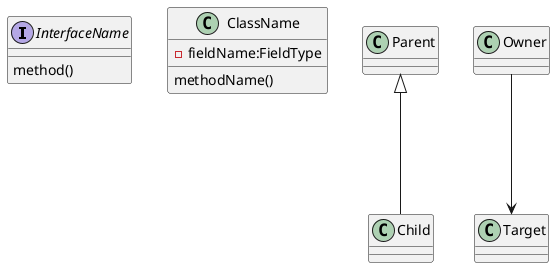

# ArchLens

A monorepo with a **Python CLI** that generates UML class diagrams from compiled binaries. Pass a `.jar` (Java) or `.dll` (C#) file and get PlantUML or yUML output.

---

## Repository Structure

```text
.
├── pyproject.toml              # Python project root (uv + setuptools)
├── archlens/                   # Python orchestrator package
│   ├── cli.py                  # Entry point: decompile command
│   ├── router.py               # Routes .jar → Java adapter, .dll → C# adapter
│   ├── config.py               # DecompileConfig dataclass
│   ├── build.py                # Entry points: build-java, build-csharp, build-all
│   └── adapters/
│       ├── java_adapter.py     # Invokes the Java fat JAR via subprocess
│       └── csharp_adapter.py   # Invokes the CSharpAnalyzer binary via subprocess
├── tests/                      # Python test suite (pytest)
├── JavaAnalyzer/               # Java decompiler (Maven + picocli)
│   ├── pom.xml
│   └── src/
├── CSharpAnalyzer/             # C# decompiler (dotnet + System.CommandLine)
│   ├── CSharpAnalyzer.csproj
│   ├── CSharpAnalyzer.slnx
│   ├── CSharpAnalyzer.Tests/
│   └── src/
└── fixtures/
    ├── java/                   # Java test fixtures (JAR + golden files)
    └── csharp/                 # C# test fixtures (DLL + golden files)
        └── TempSensor/
```

---

## Quick Start

Requires Python 3.11+, Java 25+, Maven, .NET 10+, and [uv](https://docs.astral.sh/uv/).

```bash
# Install Python dependencies
uv sync

# Build the Java fat JAR
uv run build-java

# Build the C# analyzer binary
uv run build-csharp

# Analyse a JAR
uv run archlens MyLib.jar --format plantuml

# Analyse a DLL
uv run archlens MyLib.dll --format yuml
```

---

## Python CLI

```text
Usage: archlens [-h] --format FORMAT [--ignore PATTERN] [--output FILE] FILE

  FILE             .jar or .dll file to analyse
  --format         Output format: plantuml, yuml  [required]
  --ignore PATTERN Type name pattern to exclude (repeatable)
  --output FILE    Write output to FILE instead of stdout
```

### Examples

```bash
# PlantUML from a JAR
archlens MyLib.jar --format plantuml

# yUML from a DLL
archlens MyLib.dll --format yuml

# yUML written to a file, ignoring a namespace
archlens MyLib.dll --format yuml --output diagram.yuml \
  --ignore "System.*"

# Multiple ignore patterns
archlens MyLib.jar --format plantuml \
  --ignore "java.lang.*" --ignore "java.util.*"
```

---

## Build Commands

```bash
uv run build-java    # mvn -f JavaAnalyzer/pom.xml package -DskipTests
uv run build-csharp  # dotnet build CSharpAnalyzer/
uv run build-all     # both in sequence, stops on first failure
```

---

## Java Decompiler

### How It Works

The Java adapter passes the input JAR directly to the fat JAR CLI tool, which runs a layered reflection pipeline:

```text
JAR file
   │
   ▼
JarLoader          load Class<?> objects via URLClassLoader
   │
   ▼
ClassFilter        apply --ignore patterns
   │
   ▼
ClassInspector     extract fields, methods, relationships via reflection
   │
   ▼
UmlFormatter       render to yUML or PlantUML string
   │
   ▼
stdout / file
```

Relationships are discovered entirely through reflection:

| Relationship  | Source                                          |
| ------------- | ----------------------------------------------- |
| `extends`     | `clazz.getSuperclass()`                         |
| `implements`  | `clazz.getInterfaces()`                         |
| `association` | Field types (including generic type parameters) |
| `dependency`  | Method parameter and return types               |

> Aggregation and composition cannot be distinguished via reflection — both are reported as `association`. Cardinality is not included.

### Java Package Structure

```text
org.paul/
├── Main.java                  # CLI entry point
├── config/
│   └── DecompileConfig.java   # Immutable config record
├── loader/
│   └── JarLoader.java         # Opens JAR, loads classes via URLClassLoader
├── model/
│   ├── ClassInfo.java         # Immutable snapshot of a single class
│   ├── Relationship.java      # Sealed type: Extends | Implements | Association | Dependency
│   └── FieldInfo.java         # Field name, type string, access modifier char
├── introspection/
│   └── ClassInspector.java    # Extracts ClassInfo from a Class<?> via reflection
├── filter/
│   └── ClassFilter.java       # Applies ignore patterns before introspection
└── formatter/
    ├── UmlFormatter.java      # Interface: format(List<ClassInfo>, config) → String
    ├── YumlFormatter.java     # yUML output (Classes mode)
    └── PlantUmlFormatter.java # PlantUML output
```

### Invoking the Java CLI Directly

```bash
java -jar JavaAnalyzer/target/JavaAnalyzer-1.0-SNAPSHOT.jar MyLib.jar --format plantuml
java -jar JavaAnalyzer/target/JavaAnalyzer-1.0-SNAPSHOT.jar MyLib.jar \
  --format yuml --output diagram.yuml
java -jar JavaAnalyzer/target/JavaAnalyzer-1.0-SNAPSHOT.jar MyLib.jar \
  --format plantuml --ignore "java.lang.*" --ignore "java.util.*"
```

### Java Tests

```bash
cd JavaAnalyzer && mvn test
```

---

## C# Decompiler

### How It Works

The C# adapter invokes the self-contained `CSharpAnalyzer` binary, which mirrors the Java pipeline using `System.Reflection`:

```text
DLL file
   │
   ▼
AssemblyLoader     load Type objects via Assembly.LoadFrom()
   │
   ▼
TypeFilter         apply --ignore patterns
   │
   ▼
TypeInspector      extract fields, methods, relationships via reflection
   │
   ▼
IUmlFormatter      render to yUML or PlantUML string
   │
   ▼
stdout / file
```

Key divergences from Java handled by the implementation:

| Java behaviour                        | C# equivalent                                                  |
| ------------------------------------- | -------------------------------------------------------------- |
| `getInterfaces()` — direct only       | `GetInterfaces()` returns full closure; base-type diff applied |
| `isSynthetic()` / `isBridge()`        | `IsDefined(CompilerGeneratedAttribute)` + `IsSpecialName`      |
| `name.contains("$")` — skip nested    | `Type.IsNested`                                                |
| Generic name `List`                   | Must strip backtick arity: `List\`1`→`List`                    |
| Auto-property backing fields filtered | `field.Name.StartsWith('<')` guard                             |
| `int` / `boolean` reflection names    | `Int32` / `Boolean` — exposed as-is from reflection            |

### C# Package Structure

```text
CSharpAnalyzer/
├── Program.cs                  # CLI entry point (manual arg parsing)
├── Config/
│   └── DecompileConfig.cs      # Immutable config record
├── Loader/
│   └── AssemblyLoader.cs       # Opens DLL, loads types via Assembly.LoadFrom()
├── Model/
│   ├── TypeInfo.cs             # Immutable snapshot of a single type
│   ├── Relationship.cs         # Sealed record: Extends | Implements | Association | Dependency
│   └── FieldInfo.cs            # Field name, type string, access modifier char
├── Introspection/
│   └── TypeInspector.cs        # Extracts TypeInfo from a Type via reflection
├── Filter/
│   └── TypeFilter.cs           # Applies ignore patterns before introspection
└── Formatter/
    ├── IUmlFormatter.cs        # Interface: Format(IReadOnlyList<TypeInfo>, config) → string
    ├── YumlFormatter.cs        # yUML output (Classes mode)
    └── PlantUmlFormatter.cs    # PlantUML output
```

### Invoking the C# CLI Directly

```bash
./CSharpAnalyzer/bin/Debug/net10.0/CSharpAnalyzer MyLib.dll --format plantuml
./CSharpAnalyzer/bin/Debug/net10.0/CSharpAnalyzer MyLib.dll --format yuml
./CSharpAnalyzer/bin/Debug/net10.0/CSharpAnalyzer MyLib.dll \
  --format plantuml --ignore "System.*" --output diagram.puml
```

### C# Tests

```bash
dotnet test CSharpAnalyzer/CSharpAnalyzer.slnx
```

Tests cover each layer independently (74 tests) and validate end-to-end output against golden files:

| Fixture                       | Contents                                 |
| ----------------------------- | ---------------------------------------- |
| `fixtures/csharp/TempSensor/` | Observer-pattern DLL — yUML and PlantUML |

**Golden files** are generated on first run and committed as regression anchors. To regenerate:

```bash
rm fixtures/csharp/TempSensor/TempSensor.yuml fixtures/csharp/TempSensor/TempSensor.puml
dotnet test CSharpAnalyzer/CSharpAnalyzer.slnx --filter "SelfTest"
```

---

## Output Formats

### PlantUML



### yUML (Classes mode)

```text
[ClassName|- field:Type|+ method()]
[Interface||Update()]
[IBase]^-.-[Implementor]
[Parent]^-[Child]
[Owner]->[Target]
```

Access modifier symbols:

| Modifier         | Symbol |
| ---------------- | ------ |
| `private`        | `-`    |
| `protected`      | `#`    |
| `public`         | `+`    |
| `internal` / pkg | `~`    |

Parameterized types render as `List of Observer`.

---

## Python Tests

```bash
uv run pytest -v
```

| Test file                | Coverage                                            |
| ------------------------ | --------------------------------------------------- |
| `test_router.py`         | Extension routing, case insensitivity               |
| `test_java_adapter.py`   | PlantUML/yUML output, ignore patterns, missing JAR  |
| `test_csharp_adapter.py` | PlantUML/yUML output, ignore patterns, missing DLL. |
